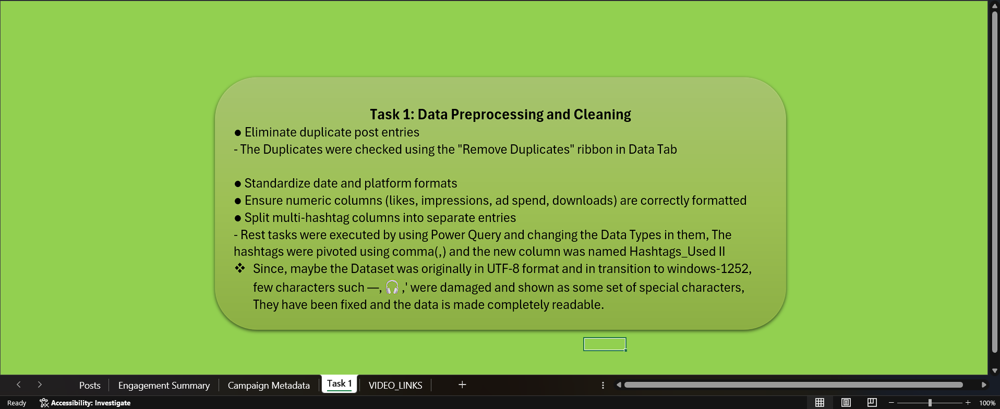
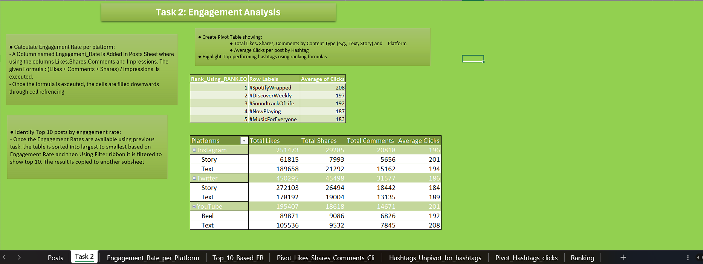
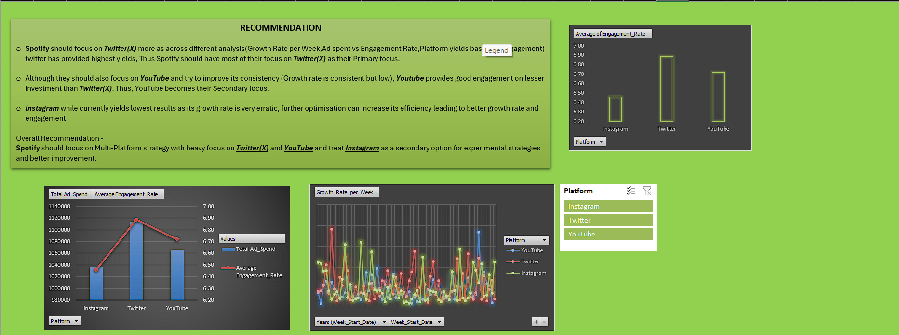
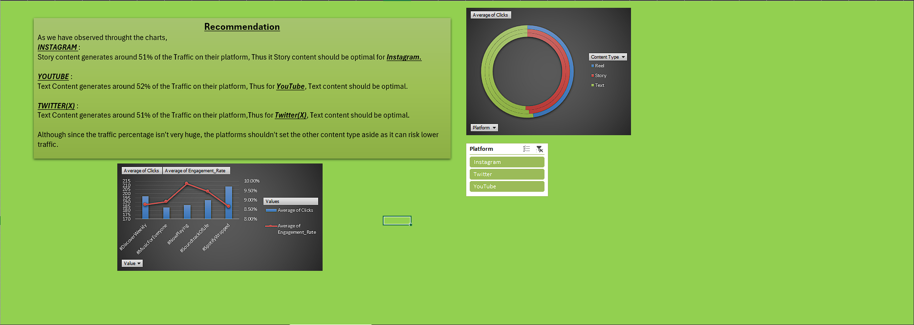
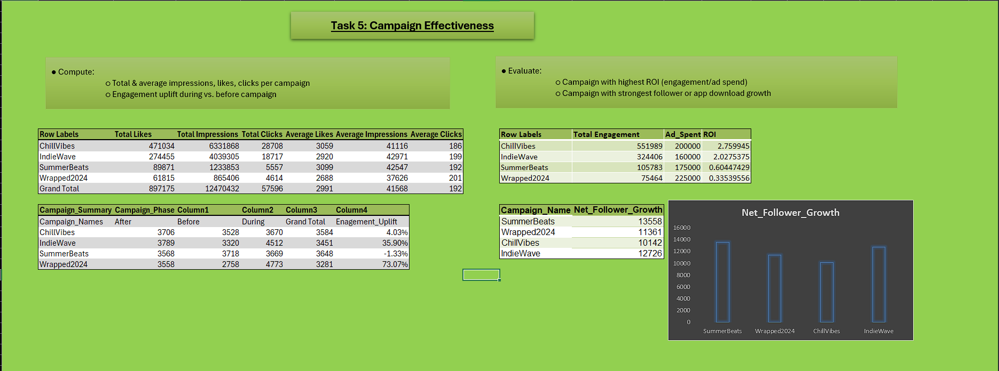
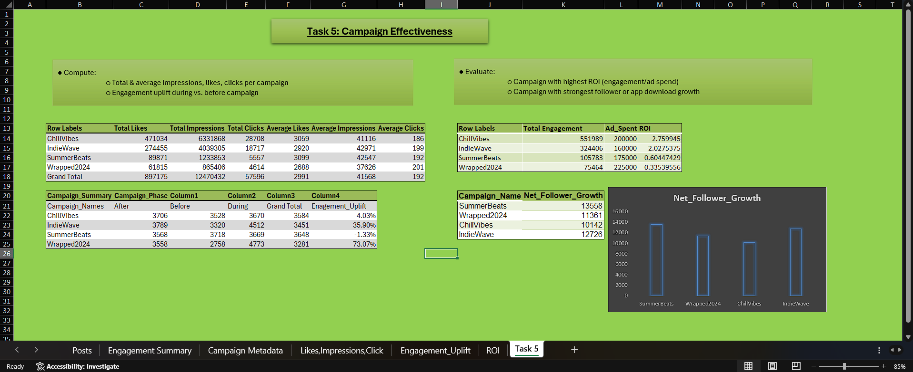

# 📊 Social Media Analytics for Strategic Branding

<p align="center">


</p>

An end-to-end **Social Media Analytics** project that transforms raw social media campaign data into actionable business insights using **Microsoft Excel**, **Power Query**, **Pivot Tables**, **Pivot Charts**, and **Interactive Dashboards**.

The project analyses engagement, content performance, campaign effectiveness, platform growth, and marketing ROI to provide strategic recommendations for improving brand performance across multiple social media platforms.

---

# 📖 Project Overview

Modern businesses rely heavily on social media platforms to engage audiences and grow their brand presence. This project demonstrates how raw marketing data can be transformed into meaningful business insights through data cleaning, exploratory analysis, KPI reporting, dashboard creation, and strategic recommendations.

The analysis focuses on evaluating campaign performance across **Instagram**, **Twitter (X)**, and **YouTube**, enabling data-driven marketing decisions.

---

# 🎯 Objectives

- Clean and preprocess raw social media data
- Standardize formats using Power Query
- Calculate engagement metrics and KPIs
- Analyse platform performance
- Evaluate marketing campaign effectiveness
- Identify high-performing hashtags and content types
- Recommend optimal marketing strategies

---

# 🛠️ Tools & Skills Used

### Software

- Microsoft Excel
- Power Query

### Excel Features

- Pivot Tables
- Pivot Charts
- Slicers
- Conditional Formatting
- Ranking Functions
- Dashboard Design
- Data Validation

### Analytics Skills

- Data Cleaning
- KPI Reporting
- Marketing Analytics
- Campaign Analysis
- ROI Analysis
- Business Intelligence
- Data Visualization

---

# 📊 Dataset

The dataset consists of social media marketing campaign data including:

- Platform
- Campaign Name
- Content Type
- Likes
- Shares
- Comments
- Clicks
- Impressions
- Downloads
- Followers
- Ad Spend
- Campaign Phase
- Hashtags
- Weekly Growth

The analysis covers multiple platforms including:

- Instagram
- Twitter (X)
- YouTube

---

# 📸 Dashboard Walkthrough

---

## 🧹 Task 1 — Data Cleaning & Preprocessing

Performed comprehensive data preparation using Excel and Power Query.

### Tasks Performed

- Removed duplicate records
- Standardized date formats
- Corrected data types
- Cleaned encoding issues
- Split multiple hashtags
- Prepared data for analysis



---

## 📈 Task 2 — Engagement Analysis

Calculated platform engagement using

> **(Likes + Comments + Shares) / Impressions**

### Analysis Included

- Top-performing posts
- Engagement Rate
- Hashtag Ranking
- Likes, Shares and Comments Analysis



---

## 📊 Task 3 — Platform Performance Analysis

Compared the performance of different social media platforms using multiple KPIs.

### Metrics Analysed

- Growth Rate
- Engagement Rate
- Click Performance
- Platform Comparison

Business recommendations were generated based on observed trends.



---

## 🎯 Task 4 — Content Strategy Analysis

Analysed different content formats to determine which content type performs best across platforms.

### Analysis Included

- Text Content
- Story Content
- Reel Performance
- Platform-wise Content Effectiveness



---

## 🚀 Task 5 — Campaign Effectiveness

Measured campaign success using marketing KPIs.

### KPIs

- Total Likes
- Total Impressions
- Total Clicks
- Average Engagement
- ROI
- Engagement Uplift
- Net Follower Growth



---

## 💡 Task 6 — Strategic Business Recommendations

The final dashboard combines all previous analyses to provide practical recommendations.

### Key Recommendations

- Prioritize **Twitter (X)** for maximum engagement.
- Continue investing in **YouTube** due to consistent performance.
- Optimise **Instagram** campaigns for improved growth.
- Adopt a balanced multi-platform marketing strategy.



---

# 📈 Key Insights

- Twitter (X) demonstrated the strongest overall engagement.
- YouTube produced consistent growth with lower investment.
- Instagram required further optimisation despite strong potential.
- Campaign ROI varied significantly across campaigns.
- Certain hashtags consistently generated higher engagement.
- Data-driven marketing decisions improve campaign effectiveness.

---

# 📂 Repository Structure

```text
Social-Media-Analytics-for-Strategic-Branding
│
├── excel-files
│   ├── Task 1 + Video Links.xlsx
│   ├── Task 2.xlsx
│   ├── Task 3.xlsx
│   ├── Task 4.xlsx
│   ├── Task 5.xlsx
│   └── Task 6.xlsx
│
├── screenshots
│   ├── task1_data_cleaning.png
│   ├── task2_engagement_analysis.png
│   ├── task3_platform_analysis.png
│   ├── task4_content_strategy.png
│   ├── task5_campaign_effectiveness.png
│   └── task6_final_recommendations.png
│
├── README.md
└── LICENSE
```

---

# 🚀 Getting Started

1. Clone the repository

```bash
git clone https://github.com/Sujal0973/Social-Media-Analytics-for-Strategic-Branding.git
```

2. Open any Excel workbook from the `excel-files` folder.

3. Explore the dashboards using the available Pivot Table filters and slicers.

---

# 🎓 Skills Demonstrated

- Microsoft Excel
- Power Query
- Data Cleaning
- Dashboard Design
- Pivot Tables
- Pivot Charts
- Marketing Analytics
- KPI Reporting
- Business Intelligence
- Data Visualization
- Business Recommendation Writing

---

# 👨‍💻 Authors

**Sujal Agrahari**

Artificial Intelligence & Machine Learning

Dr. Ambedkar Institute of Technology

---

**Project Guide**

Internshala Trainings

---

## ⭐ Acknowledgement

This project was developed as part of the **Data Management and Analysis with MS Excel** training offered by **Internshala Trainings**. The project demonstrates practical applications of Excel-based data cleaning, dashboard development, KPI analysis, and business intelligence techniques learned during the course.

## 📌 Note

This repository is intended for educational and portfolio purposes. The dataset was provided as part of the Internshala training, while the analysis, dashboards, visualizations, and business recommendations were created by the author.

---

⭐ If you found this project useful, consider giving the repository a **Star**!